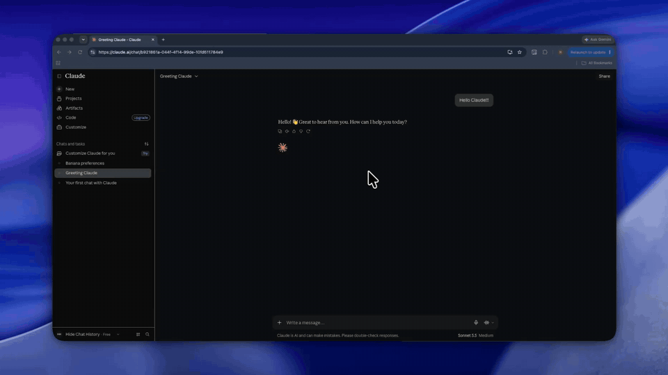
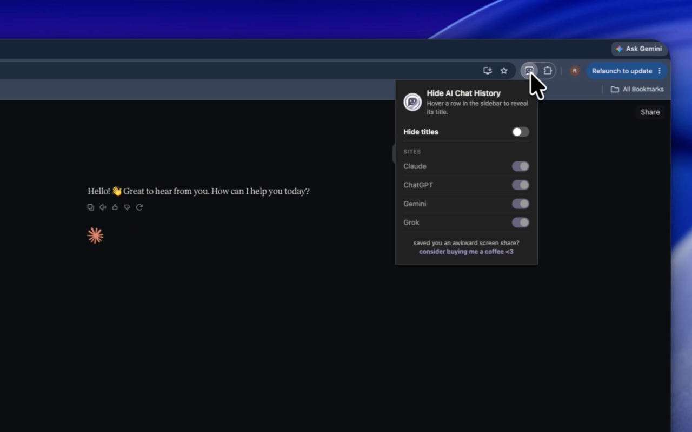

# Hide AI Chat History

A Chrome extension that hides the chat titles in the sidebar on ChatGPT, Claude, Gemini and Grok. Hover over a chat and its title shows up again.

It's for when you're sharing your screen or someone's sitting next to you, and you'd rather they didn't read everything you've asked an AI.

## How to use

Once it's installed, the titles in the sidebar are hidden on all four sites. To see one, hover over its row. A title also shows when you tab to it with the keyboard, or when you open that chat's menu to rename or delete it.

Click the extension's icon to change the settings. "Hide titles" turns hiding on or off everywhere, and the switches under Sites turn it off for one site at a time. Settings are saved with Chrome sync, so if sync is on, they follow you to your other computers.

## Install

The Chrome Web Store link is coming soon. Until then, you can load it from source:

1. Clone this repo, or download it as a ZIP and unzip it.
2. Open `chrome://extensions`.
3. Turn on Developer mode in the top right corner.
4. Click Load unpacked and select the repo folder.

## Privacy

The extension only runs on claude.ai, chatgpt.com, gemini.google.com and grok.com. Its one permission is `storage`, which it uses to save your settings. It doesn't read your chats, make network requests or collect anything. There are under 80 lines of JavaScript in total, so it won't take long to check.

## How it works

Each site has a stylesheet in `sites/` that sets the sidebar titles to `opacity: 0`, then brings a title back on hover, on keyboard focus, or while that row's menu is open. Chrome injects these stylesheets before the page renders, so titles don't flash on screen while the page loads.

`content.js` reads your settings. When hiding is off for the current site, it adds a `data-hch-off` attribute to the page's `<html>` element, and every rule in the stylesheets is written to skip pages with that attribute. If the site's own code removes the attribute, the script adds it back.

The popup (`popup/`) builds its list of sites from `shared/sites.js` and saves changes to `chrome.storage.sync`. Open tabs pick up the change right away.

## When a site changes its layout

These sites update their HTML often, and when they do, titles can start showing again. If you notice that, please open an issue and say which site it is. If you'd like to fix it yourself, the selectors for each site are in `sites/<site>.css`.

To add a new site:

1. Add it to `HCH_SITES` in `shared/sites.js`. The popup will list it automatically.
2. Write a stylesheet for it in `sites/`.
3. Add a `content_scripts` entry in `manifest.json` that matches the site and loads your stylesheet, `shared/sites.js` and `content.js`.

## Support

If it saved you an awkward screen share, [consider buying me a coffee](https://ko-fi.com/swerami) <3

## License

MIT. See [LICENSE](LICENSE).
